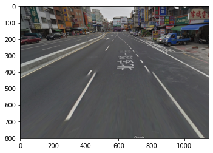

.. code:: ipython3

    from tensorflow import keras
    size = 224
    base_model = keras.applications.VGG19(weights='imagenet', input_shape=(size, size, 3), include_top=False)
    base_model.trainable = False
    
    inputs = keras.Input(shape=(size, size, 3))
    x = base_model(inputs, training=False)
    x = keras.layers.GlobalAveragePooling2D()(x)
    outputs = keras.layers.Dense(1)(x)
    model = keras.Model(inputs, outputs)
                        
    model.summary()

.. parsed-literal::

    Downloading data from https://storage.googleapis.com/tensorflow/keras-applications/vgg19/vgg19_weights_tf_dim_ordering_tf_kernels_notop.h5
    80142336/80134624 [==============================] - 0s 0us/step
    Model: "model"
    _________________________________________________________________
    Layer (type)                 Output Shape              Param #   
    =================================================================
    input_2 (InputLayer)         [(None, 224, 224, 3)]     0         
    _________________________________________________________________
    vgg19 (Model)                (None, 7, 7, 512)         20024384  
    _________________________________________________________________
    global_average_pooling2d (Gl (None, 512)               0         
    _________________________________________________________________
    dense (Dense)                (None, 1)                 513       
    =================================================================
    Total params: 20,024,897
    Trainable params: 513
    Non-trainable params: 20,024,384
    _________________________________________________________________

.. code:: ipython3

    model.compile(loss=keras.losses.BinaryCrossentropy(from_logits=True), metrics=[keras.metrics.BinaryAccuracy()])

.. code:: ipython3

    from tensorflow.keras.preprocessing.image import ImageDataGenerator
    datagen = ImageDataGenerator(samplewise_center=True,
                    rotation_range=10,
                    zoom_range=0.2,
                    width_shift_range=0.2,
                    height_shift_range=0.2,
                    horizontal_flip=True,
                    vertical_flip=True)

.. code:: ipython3

    train_it = datagen.flow_from_directory('train',
                         target_size=(224, 224),
                         color_mode='rgb',
                         batch_size=6)
    
    valid_it = datagen.flow_from_directory('valid',
                         target_size=(224, 224),
                         color_mode='rgb',
                         batch_size=6)

.. parsed-literal::

    Found 150 images belonging to 3 classes.
    Found 72 images belonging to 3 classes.

.. code:: ipython3

    model.fit(train_it,steps_per_epoch=train_it.samples/train_it.batch_size,
         validation_data=valid_it, validation_steps=valid_it.samples/valid_it.batch_size,
         epochs=20)

.. parsed-literal::

    Epoch 1/20
    25/25 [==============================] - 70s 3s/step - loss: 1.6982 - binary_accuracy: 0.5800 - val_loss: 1.3607 - val_binary_accuracy: 0.5278
    Epoch 2/20
    25/25 [==============================] - 69s 3s/step - loss: 1.4576 - binary_accuracy: 0.5800 - val_loss: 1.2917 - val_binary_accuracy: 0.5880
    Epoch 3/20
    25/25 [==============================] - 71s 3s/step - loss: 1.4084 - binary_accuracy: 0.5711 - val_loss: 1.2013 - val_binary_accuracy: 0.6343
    Epoch 4/20
    25/25 [==============================] - 70s 3s/step - loss: 1.2555 - binary_accuracy: 0.5867 - val_loss: 1.2566 - val_binary_accuracy: 0.5370
    Epoch 5/20
    25/25 [==============================] - 71s 3s/step - loss: 1.1292 - binary_accuracy: 0.5733 - val_loss: 1.1978 - val_binary_accuracy: 0.6019
    Epoch 6/20
    25/25 [==============================] - 66s 3s/step - loss: 1.0679 - binary_accuracy: 0.5978 - val_loss: 1.0927 - val_binary_accuracy: 0.5231
    Epoch 7/20
    25/25 [==============================] - 69s 3s/step - loss: 1.1077 - binary_accuracy: 0.6022 - val_loss: 1.2196 - val_binary_accuracy: 0.5787
    Epoch 8/20
    25/25 [==============================] - 67s 3s/step - loss: 1.0071 - binary_accuracy: 0.5844 - val_loss: 0.9406 - val_binary_accuracy: 0.6296
    Epoch 9/20
    25/25 [==============================] - 69s 3s/step - loss: 0.9849 - binary_accuracy: 0.5956 - val_loss: 1.0676 - val_binary_accuracy: 0.6574
    Epoch 10/20
    25/25 [==============================] - 70s 3s/step - loss: 0.9530 - binary_accuracy: 0.5978 - val_loss: 0.9618 - val_binary_accuracy: 0.6157
    Epoch 11/20
    25/25 [==============================] - 68s 3s/step - loss: 0.9339 - binary_accuracy: 0.5911 - val_loss: 1.0912 - val_binary_accuracy: 0.6435
    Epoch 12/20
    25/25 [==============================] - 69s 3s/step - loss: 0.9038 - binary_accuracy: 0.6067 - val_loss: 0.9655 - val_binary_accuracy: 0.6157
    Epoch 13/20
    25/25 [==============================] - 70s 3s/step - loss: 0.8838 - binary_accuracy: 0.6111 - val_loss: 0.9581 - val_binary_accuracy: 0.6065
    Epoch 14/20
    25/25 [==============================] - 69s 3s/step - loss: 0.9183 - binary_accuracy: 0.6111 - val_loss: 0.9157 - val_binary_accuracy: 0.6065
    Epoch 15/20
    25/25 [==============================] - 68s 3s/step - loss: 0.8588 - binary_accuracy: 0.6178 - val_loss: 0.9672 - val_binary_accuracy: 0.6343
    Epoch 16/20
    25/25 [==============================] - 68s 3s/step - loss: 0.8608 - binary_accuracy: 0.6178 - val_loss: 0.9329 - val_binary_accuracy: 0.5741
    Epoch 17/20
    25/25 [==============================] - 71s 3s/step - loss: 0.8709 - binary_accuracy: 0.6133 - val_loss: 0.9280 - val_binary_accuracy: 0.6528
    Epoch 18/20
    25/25 [==============================] - 71s 3s/step - loss: 0.8330 - binary_accuracy: 0.6200 - val_loss: 0.9008 - val_binary_accuracy: 0.5741
    Epoch 19/20
    25/25 [==============================] - 66s 3s/step - loss: 0.8332 - binary_accuracy: 0.6200 - val_loss: 0.8651 - val_binary_accuracy: 0.6250
    Epoch 20/20
    25/25 [==============================] - 72s 3s/step - loss: 0.7962 - binary_accuracy: 0.6311 - val_loss: 0.8424 - val_binary_accuracy: 0.6157

.. parsed-literal::

    <tensorflow.python.keras.callbacks.History at 0x7f10a87cbcc0>

.. code:: ipython3

    base_model.trainable = True
    model.compile(optimizer=keras.optimizers.RMSprop(learning_rate = 0.0001),
           loss=keras.losses.BinaryCrossentropy(from_logits=True),
           metrics=[keras.metrics.BinaryAccuracy()])

.. code:: ipython3

    model.fit(train_it,steps_per_epoch=train_it.samples/train_it.batch_size,
         validation_data=valid_it, validation_steps=valid_it.samples/valid_it.batch_size,
         epochs=20)

.. parsed-literal::

    Epoch 1/20
    25/25 [==============================] - 71s 3s/step - loss: 0.6390 - binary_accuracy: 0.6667 - val_loss: 0.6365 - val_binary_accuracy: 0.6667
    Epoch 2/20
    25/25 [==============================] - 70s 3s/step - loss: 0.6369 - binary_accuracy: 0.6667 - val_loss: 0.6367 - val_binary_accuracy: 0.6667
    Epoch 3/20
    25/25 [==============================] - 70s 3s/step - loss: 0.6366 - binary_accuracy: 0.6667 - val_loss: 0.6366 - val_binary_accuracy: 0.6667
    Epoch 4/20
    25/25 [==============================] - 68s 3s/step - loss: 0.6368 - binary_accuracy: 0.6667 - val_loss: 0.6365 - val_binary_accuracy: 0.6667
    Epoch 5/20
    25/25 [==============================] - 71s 3s/step - loss: 0.6368 - binary_accuracy: 0.6667 - val_loss: 0.6365 - val_binary_accuracy: 0.6667
    Epoch 6/20
    25/25 [==============================] - 70s 3s/step - loss: 0.6367 - binary_accuracy: 0.6667 - val_loss: 0.6365 - val_binary_accuracy: 0.6667
    Epoch 7/20
    25/25 [==============================] - 70s 3s/step - loss: 0.6366 - binary_accuracy: 0.6667 - val_loss: 0.6365 - val_binary_accuracy: 0.6667
    Epoch 8/20
    25/25 [==============================] - 71s 3s/step - loss: 0.6366 - binary_accuracy: 0.6667 - val_loss: 0.6365 - val_binary_accuracy: 0.6667
    Epoch 9/20
    25/25 [==============================] - 70s 3s/step - loss: 0.6369 - binary_accuracy: 0.6667 - val_loss: 0.6365 - val_binary_accuracy: 0.6667
    Epoch 10/20
    25/25 [==============================] - 70s 3s/step - loss: 0.6365 - binary_accuracy: 0.6667 - val_loss: 0.6365 - val_binary_accuracy: 0.6667
    Epoch 11/20
    25/25 [==============================] - 70s 3s/step - loss: 0.6365 - binary_accuracy: 0.6667 - val_loss: 0.6365 - val_binary_accuracy: 0.6667
    Epoch 12/20
    25/25 [==============================] - 70s 3s/step - loss: 0.6367 - binary_accuracy: 0.6667 - val_loss: 0.6365 - val_binary_accuracy: 0.6667
    Epoch 13/20
    25/25 [==============================] - 70s 3s/step - loss: 0.6365 - binary_accuracy: 0.6667 - val_loss: 0.6366 - val_binary_accuracy: 0.6667
    Epoch 14/20
    25/25 [==============================] - 71s 3s/step - loss: 0.6365 - binary_accuracy: 0.6667 - val_loss: 0.6365 - val_binary_accuracy: 0.6667
    Epoch 15/20
    25/25 [==============================] - 69s 3s/step - loss: 0.6366 - binary_accuracy: 0.6667 - val_loss: 0.6365 - val_binary_accuracy: 0.6667
    Epoch 16/20
    25/25 [==============================] - 69s 3s/step - loss: 0.6365 - binary_accuracy: 0.6667 - val_loss: 0.6365 - val_binary_accuracy: 0.6667
    Epoch 17/20
    25/25 [==============================] - 70s 3s/step - loss: 0.6365 - binary_accuracy: 0.6667 - val_loss: 0.6365 - val_binary_accuracy: 0.6667
    Epoch 18/20
    25/25 [==============================] - 70s 3s/step - loss: 0.6365 - binary_accuracy: 0.6667 - val_loss: 0.6365 - val_binary_accuracy: 0.6667
    Epoch 19/20
    25/25 [==============================] - 71s 3s/step - loss: 0.6365 - binary_accuracy: 0.6667 - val_loss: 0.6365 - val_binary_accuracy: 0.6667
    Epoch 20/20
    25/25 [==============================] - 69s 3s/step - loss: 0.6365 - binary_accuracy: 0.6667 - val_loss: 0.6365 - val_binary_accuracy: 0.6667

.. parsed-literal::

    <tensorflow.python.keras.callbacks.History at 0x7f10a78b5898>

.. code:: ipython3

    import matplotlib.pyplot as plt
    import matplotlib.image as mpimg
    from tensorflow.keras.preprocessing import image as image_utils
    from tensorflow.keras.applications.imagenet_utils import preprocess_input
    
    def show_image(image_path):
        image = mpimg.imread(image_path)
        plt.imshow(image)
    
    def make_predictions(image_path):
        show_image(image_path)
        image = image_utils.load_img(image_path, target_size=(224, 224))
        image = image_utils.img_to_array(image)
        image = image.reshape(1,224,224,3)
        image = preprocess_input(image)
        preds = model.predict(image)
        return preds
        
    def foreign_object_detector(image_path):
        preds = make_predictions(image_path)
        if preds[0] < 0:
            print("道路順暢 沒有障礙")
        else:
            print("小心!!前方有障礙")

.. code:: ipython3

    foreign_object_detector("valid/只有路/道路照片 - Google 搜尋 5.png")

.. parsed-literal::

    道路順暢 沒有障礙

